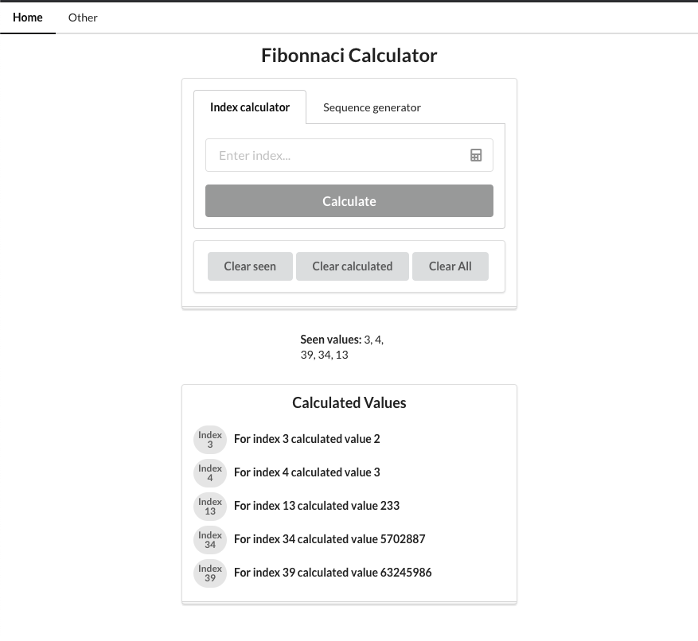
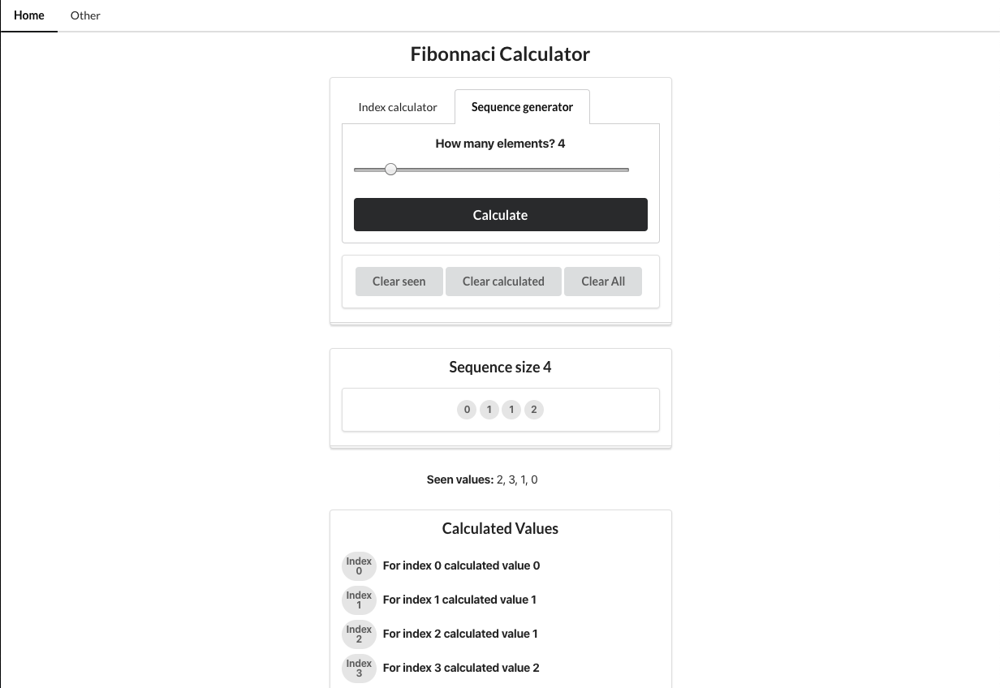

# Multi contanainer Fibonnaci Calculator

This is an overcomplicated Fibonnaci Calculator web app.

The calculator has two modes:

### Index Calculator

Calculates the fibonnaci sequence value for the given index:

### Sequence Generator

Generates fibonnaci sequence with the defined number of elements:

## Architecture

This web app is composed by the following containers:

- **client:** react app where are displayed the results of the calculations.
- **server:** a node.js server with a exposed REST API that handles the requests from the frontend, loading the already calculated
  data or submiting new indexes into redis to be calculated by the worker. Inserts all the submited indexes into a Postgres database
- **worker:** subscribes on redis and calculates the fibonnaci values for the submited indexes.
- **nginx:** does the routing between the various modules of this project
- **postgres:** database where is stored all the "seen" indexes (indexes that were already submited).
- **redis:** stores all the temporary data need by the worker to calculate and publish the fibonnaci values.

**Note:** On the AWS enviroment, we don't use containers for postgres and redis. Postgres is RDS instance and Redis is created on ElastiCache

## CI/CD

The goal of this project was to setup an CI/CD workflow of a multiple container application:

1. Run Dev version of the app locally with docker-compose with hot reload feature inside the containers
2. Build and test app with travis-ci on merge/commit to master
3. If successful, deploy to AWS Elastic Beanstalk

## AWS Configuration Cheat Sheet

### RDS Database Creation

1. Go to AWS Management Console and use Find Services to search for RDS

2. Click Create database button

3. Select PostgreSQL

4. Check 'only enable options eligible for RDS Free Usage Tier' and click Next button

5. Scroll down to Settings Form

6. Set DB Instance identifier to multi-docker-postgres

7. Set Master Username to postgres

8. Set Master Password to postgres and confirm

9. Click Next button

10. Make sure VPC is set to Default VPC

11. Scroll down to Database Options

12. Set Database Name to fibvalues

13. Scroll down and click Create Database button

### ElastiCache Redis Creation

1. Go to AWS Management Console and use Find Services to search for ElastiCache

2. Click Redis in sidebar

3. Click the Create button

4. Make sure Redis is set as Cluster Engine

5. In Redis Settings form, set Name to multi-docker-redis

6. Change Node type to 'cache.t2.micro'

7. Change Number of replicas to 0

8. Scroll down to Advanced Redis Settings

9. Subnet Group should say “Create New"

10. Set Name to redis-group

11. VPC should be set to default VPC

12. Tick all subnet’s boxes

13. Scroll down and click Create button

### Creating a Custom Security Group

1. Go to AWS Management Console and use Find Services to search for VPC

2. Click Security Groups in sidebar

3. Click Create Security Group button

4. Set Security group name to multi-docker

5. Set Description to multi-docker

6. Set VPC to default VPC

7. Click Create Button

8. Click Close

9. Manually tick the empty field in the Name column of the new security group and type multi-docker, then click the checkmark icon.

10. Scroll down and click Inbound Rules

11. Click Edit Rules button

12. Click Add Rule

13. Set Port Range to 5432-6379

14. Click in box next to Custom and start typing 'sg' into the box. Select the Security Group you just created, it should look similar to 'sg-…. | multi-docker’

15. Click Save Rules button

16. Click Close

### Applying Security Groups to ElastiCache

1. Go to AWS Management Console and use Find Services to search for ElastiCache

2. Click Redis in Sidebar

3. Check box next to Redis cluster and click Modify

4. Change VPC Security group to the multi-docker group and click Save

5. Click Modify

### Applying Security Groups to RDS

1. Go to AWS Management Console and use Find Services to search for RDS

2. Click Databases in Sidebar and check box next to your instance

3. Click Modify button

4. Scroll down to Network and Security change Security group to multi-docker

5. Scroll down and click Continue button

6. Click Modify DB instance button

### Applying Security Groups to Elastic Beanstalk

1. Go to AWS Management Console and use Find Services to search for Elastic Beanstalk

2. Click the multi-docker application tile

3. Click Configuration link in Sidebar

4. Click Modify in Instances card

5. Scroll down to EC2 Security Groups and tick box next to multi-docker

6. Click Apply and Click Confirm

### Setting Environment Variables

1. Go to AWS Management Console and use Find Services to search for Elastic Beanstalk

2. Click the multi-docker application tile

3. Click Configuration link in Sidebar

4. Select Modify in the Software tile

5. Scroll down to Environment properties

6. In another tab Open up ElastiCache, click Redis and check the box next to your cluster. Find the Primary Endpoint and copy that value but omit the :6379

7. Set REDIS_HOST key to the primary endpoint listed above, remember to omit :6379

8. Set REDIS_PORT to 6379

9. Set PGUSER to postgres

10. Set PGPASSWORD to postgrespassword

11. In another tab, open up RDS dashboard, click databases in sidebar, click your instance and scroll to Connectivity and Security. Copy the endpoint.

12. Set the PGHOST key to the endpoint value listed above.

13. Set PGDATABASE to fibvalues

14. Set PGPORT to 5432

15. Click Apply button

### IAM Keys for Deployment

1. Go to AWS Management Console and use Find Services to search for IAM

2. Click Users link in the Sidebar

3. Click Add User button

4. Set User name to multi-docker-deployer

5. Set Access-type to Programmatic Access

6. Click Next:Permissions button

7. Select Attach existing polices directly button

8. Search for 'beanstalk' and check all boxes

9. Click Next:Review

10. Add tag if you want and Click Next:Review

11. Click Create User

12. Copy Access key ID and secret access key for use later

### AWS Keys in Travis

1. Open up Travis dashboard and find your multi-docker app

2. Click More Options, and select Settings

3. Scroll to Environment Variables

4. Add AWS_ACCESS_KEY and set to your AWS access key

5. Add AWS_SECRET_KEY and set to your AWS secret key

The whole project was based on the following udemy course: https://www.udemy.com/course/docker-and-kubernetes-the-complete-guide
